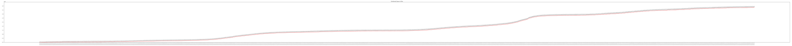
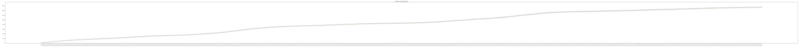

% Coronavirus (COVID-19) Cases in Ohio Dashboard

## Daily Statistics in Ohio

<!--    -->
Total confirmed cases:

Newly confirmed cases:

7-day Moving Average:
  

Number of ICU Admissions:
  

Number of Hospitalizations:
  

Number of Deaths:

(To view the original image: right click on a figure and choose "Open Image in New Tab")

## County Statistics

<!-- bokeh_block_start -->

<!-- bokeh_block_end -->

## Project Information

* Automatically update around 2pm daily.
<!-- * Short URL: [https://bit.ly/covid-19-ohio](https://bit.ly/covid-19-ohio) -->
* COVID-19 cases in Ohio datasets:
  * [JSON](./data/ohio.json)
  * [CSV](./data/ohio.csv)
  * Data source: [coronavirus.ohio.gov](https://coronavirus.ohio.gov)
* Help to contribute:
  * [Project source code](https://github.com/YSU-Data-Lab/coronavirus-dashboard)
  * [Submit a git issue or suggestion](https://github.com/YSU-Data-Lab/coronavirus-dashboard/issues)
* Thanks to:
  * [Ohio Supercomputer Center](https://www.osc.edu/)
  * [GitHub](https://github.com/)

